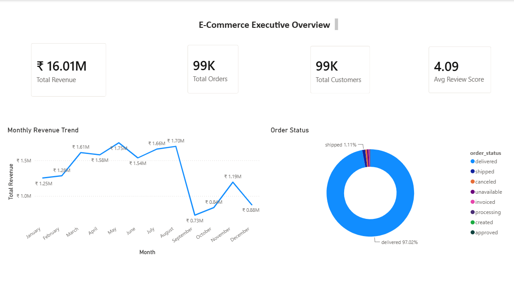
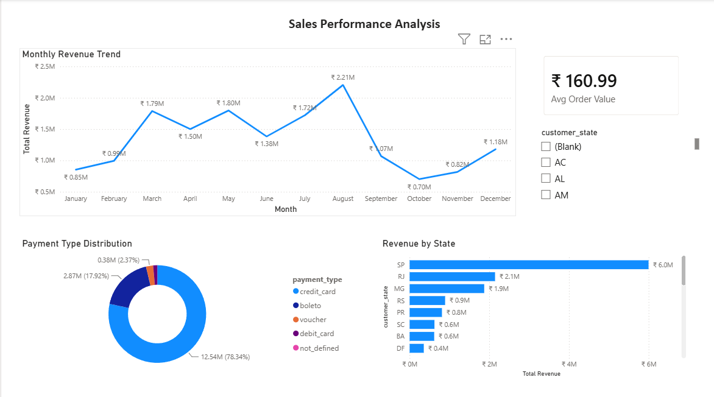
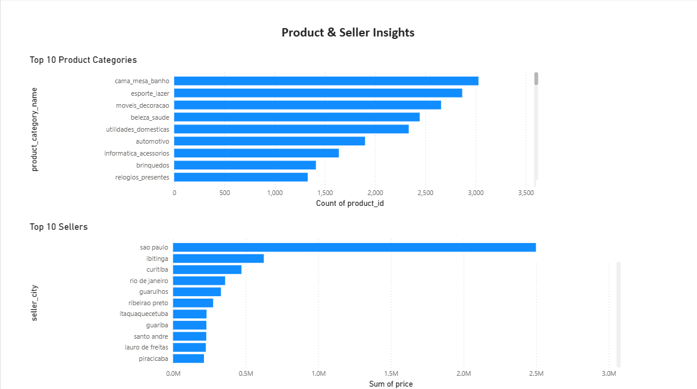
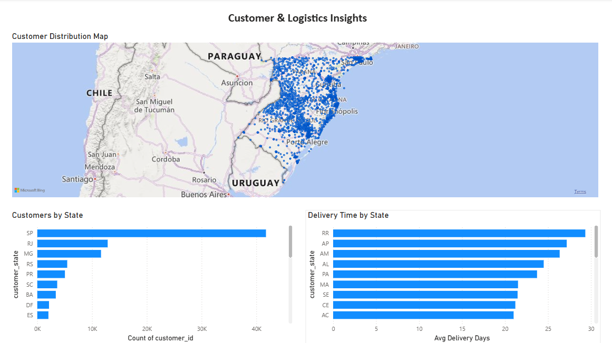

# 🚀 E-Commerce Analytics Pipeline

An end-to-end Data Engineering and Business Intelligence project built using the Olist Brazilian E-Commerce dataset.

## 📌 Project Goal

Build a scalable analytics pipeline that loads raw e-commerce data into PostgreSQL, performs business analysis using SQL, and visualizes insights through interactive Power BI dashboards.

---

## 🏗️ Architecture

```text
CSV Files
    ↓
Python ETL
    ↓
PostgreSQL
    ↓
Analytics SQL
    ↓
Power BI Dashboards
```

---

## 🛠️ Tech Stack

- Python
- PostgreSQL
- SQL
- Power BI
- Git

---

## 📂 Dataset

- Olist Brazilian E-Commerce Dataset
- Analysis Period: 2016–2018

---

## 📊 Dashboards

- Executive Overview
- Sales Performance Analysis
- Product & Seller Insights
- Customer & Logistics Insights


    ### Executive Overview
    Provides a high-level business summary including revenue, orders, customers, and KPIs.

    

    ---

    ### Sales Performance
    Analyzes monthly sales trends, revenue growth, and top-performing regions.

    

    ---

    ### Product & Seller Insights
    Highlights product categories, seller performance, and profitability.

    

    ---

    ### Customer & Logistics Insights
    Visualizes customer distribution, shipping performance, and delivery metrics.

    

---

## 📁 Project Structure

```text
ecommerce-analytics-pipeline/
├── data/
├── src/
├── sql/
├── powerbi/
├── screenshots/
├── README.md
├── requirements.txt
└── .gitignore
```

---

## 🚀 Future Enhancements

- Apache Airflow for ETL orchestration
- AWS S3 for cloud data storage
- Docker for containerization